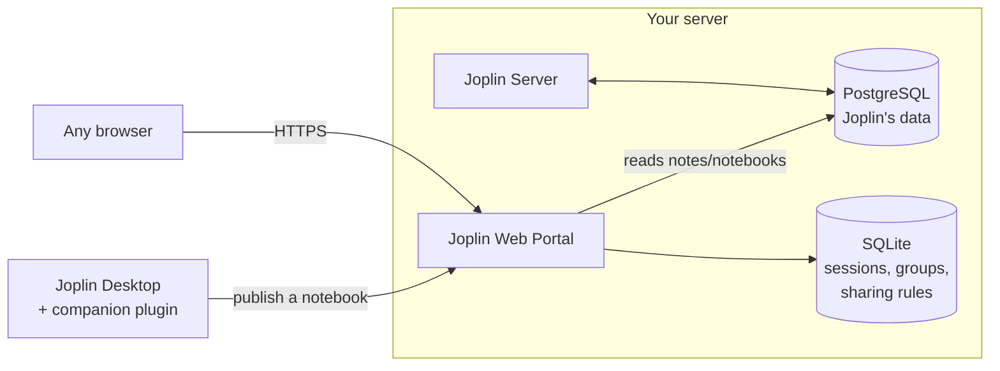

<div align="center">

# 📓 Joplin Web Portal

**A lightweight, installable web viewer for your self-hosted [Joplin](https://joplinapp.org) notes.**
Read your notebooks from any browser, on any device — no app to install, nothing left behind when you close the tab.

[](https://github.com/william-webext/joplin-web/actions/workflows/docker.yml)


[](./LICENSE)

</div>

---

## Why this exists

Joplin has an official desktop and mobile app — but sometimes you just need to check a note from **a computer that isn't yours**: a work PC, a library computer, a friend's laptop where you don't have (or don't want) admin rights to install anything.

Joplin Web Portal solves exactly that: point any browser at your own server, log in, read your notes, close the tab — nothing is left behind. No install, no sync client, no trace.

## What it does

- 📖 **Read-only web viewer** for a self-hosted Joplin Server instance — browse notebooks, read notes, follow links, view attachments and images
- 🔒 **Session-based access** — log in, browse, log out (or just close the tab); nothing persists locally beyond your session
- 🌍 **Granular sharing** — publish notebooks as **public** (anyone with the link), **private** (any logged-in user), or **custom** (specific users or groups only)
- 👥 **Group management** — an admin panel to organize users into groups and grant them access to specific notebooks
- 📱 **Installable PWA** — add it to your phone's home screen or your desktop like a native app, with offline caching for notes you've already opened
- 🔌 **Companion Joplin plugin** — publish a notebook straight from Joplin Desktop with a couple of clicks, no manual steps on the server side
- 🔎 Full-text search across titles, note content, and tags (multi-word, order-independent)
- 📌 Pin favorite notebooks, drag-and-drop (or keyboard) reordering of your notebook tree
- 🎨 Dark / light / system theme, adjustable reading width, Zen reading mode
- 📄 Export an entire notebook to PDF, complete with a clickable index page
- ⌨️ Keyboard shortcuts for anyone who lives in the app (`/` to search, arrow keys to browse, `Esc` to close anything)

## How it works



The portal never touches your notes — it only **reads** from the same PostgreSQL database your Joplin Server already uses, and keeps its own small SQLite database for things that are specific to the web portal: sessions, sharing rules, groups, and per-user preferences.

## Requirements

- A running **Joplin Server** instance (self-hosted), synced with PostgreSQL — [see Joplin Server docs](https://joplinapp.org/help/apps/sync/joplin_server)
- Docker and Docker Compose
- **End-to-end encryption must be disabled** on the notes you want to publish through the portal — the server reads note content directly from the database, which isn't possible if it's encrypted

## Quick start

```yaml
services:
  joplin-web:
    image: ghcr.io/william-webext/joplin-web:latest
    container_name: joplin-web
    depends_on:
      - db
    ports:
      - "3000:3000"
    environment:
      DB_HOST: db
      DB_PORT: 5432
      DB_USER: joplinuser
      DB_PASSWORD: <your Postgres password>
      DB_NAME: joplin
    volumes:
      - ./joplin-web-data:/app/data
    restart: on-failure:5
```

Point it at the **same PostgreSQL database** your Joplin Server uses. On first launch it creates its own SQLite database in `/app/data` for sessions, sharing rules, and groups — make sure that path is a persistent volume, or you'll lose that data on every restart.

Open `http://your-server:3000`, and you're in.

## Configuration

| Variable | Default | What it does |
|---|---|---|
| `DB_HOST` | `db` | Hostname of your Postgres instance (Joplin Server's database) |
| `DB_PORT` | `5432` | Postgres port |
| `DB_USER` | `joplinuser` | Postgres user |
| `DB_PASSWORD` | — | Postgres password (**required**) |
| `DB_NAME` | `joplin` | Postgres database name |
| `DATA_DIR` | `./data` | Where the portal's own SQLite database is stored |
| `ALLOWED_ORIGIN` | *(open)* | Restrict CORS to a specific origin, e.g. `https://notes.example.com` — recommended for production |
| `TRUST_PROXY` | *(off)* | Set to `1` if you're running behind a reverse proxy or tunnel (Cloudflare Tunnel, nginx, etc.) — needed for accurate rate limiting by IP |

## Going beyond your local network

By default this runs on your local network only. If you want to reach it from outside — say, from your phone while you're out, or to actually use it as "open any browser, anywhere" — you need HTTPS in front of it. Two common, free ways to do that without exposing your NAS directly to the internet:

- **[Cloudflare Tunnel](https://developers.cloudflare.com/cloudflare-one/connections/connect-networks/)** — free, no port forwarding, no public IP needed. A small container (`cloudflared`) on your network creates an outbound connection to Cloudflare, which then serves your app over HTTPS on a domain of your choice. Works well with Docker Compose — add it as another service alongside `joplin-web`.
- **A local reverse proxy container** (e.g. [Caddy](https://caddyserver.com/), [Traefik](https://traefik.io/), or [Nginx Proxy Manager](https://nginxproxymanager.com/)) if you'd rather manage your own certificates and port forwarding.

Either way, once it's reachable over HTTPS from outside your network, set `ALLOWED_ORIGIN` to that exact domain and `TRUST_PROXY=1` — see the table above.

## The companion plugin

Publishing a notebook is a two-click job from Joplin Desktop, once the plugin is installed: right-click a notebook → **Publish to Web** → choose public, private, or specific people/groups. The plugin talks directly to your portal's API — no manual database edits, no separate admin step.

- 📦 Plugin repository: [github.com/william-webext/joplin-plugin-web-publisher](https://github.com/william-webext/joplin-plugin-web-publisher)
- 🧩 Joplin plugin listing: [joplinapp.org/plugins/plugin/com.william.webppublisher](https://joplinapp.org/plugins/plugin/com.william.webppublisher/)
- 📥 npm package: [npmjs.com/package/joplin-plugin-web-publisher](https://www.npmjs.com/package/joplin-plugin-web-publisher)

## Security notes

- Sessions use random, server-signed tokens (never your Joplin password) with a sliding expiry — active users are never logged out mid-read
- Every publish action is checked against real notebook ownership — you can only publish notebooks that are actually yours
- Login endpoints are rate-limited per IP
- All user-supplied content (note bodies, titles, tags) is sanitized before rendering — safe to publish notebooks that contain arbitrary Markdown/HTML from untrusted sources

Found a security issue? Please report it privately rather than opening a public issue — see [Support](#support--feedback) below.

## Support / feedback

Something broken, or a feature you'd like to see? Write to **joplin [at] rossodivino [dot] com** — happy to hear about bugs, ideas, or just what you're using this for.

## Support the project

This project is free, open source, and maintained in spare time. If it's useful to you, consider [buying me a coffee on PayPal](https://paypal.me/webext) — every bit helps keep it going. There's also a **☕ Support this project** button in the app itself (top toolbar).

## License

Licensed under the **[GNU Affero General Public License v3.0](./LICENSE)**. In short: you're free to use, modify, and self-host this software. If you modify it and offer it as a service to others — not just run it privately — you must make your modified source available too, under the same license. This applies to network use, not only distributed copies.
